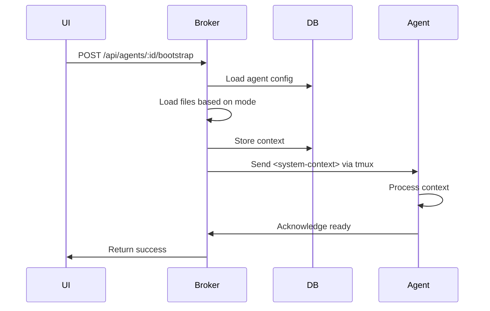

# Phase 3: Bootstrap System Implementation Guide

## Overview

This guide provides step-by-step instructions for implementing the Bootstrap System specified in `docs/specs/BOOTSTRAP_SPECIFICATION.md`.

## Prerequisites

- [ ] Phase 2 agent configuration must be complete
- [ ] Database migrations system must be in place
- [ ] Agent registry must support status updates

## Implementation Steps

### Step 1: Database Setup (Day 1, Morning)

#### 1.1 Create Migration File

Create `broker/src/db/migrations/005_add_bootstrap_tables.sql`:

```sql
-- Add bootstrap fields to agent_configs table (not agents!)
ALTER TABLE agent_configs ADD COLUMN last_bootstrap TEXT;
ALTER TABLE agent_configs ADD COLUMN bootstrap_count INTEGER DEFAULT 0;

-- Add bootstrap context storage to agents table (runtime instances)
ALTER TABLE agents ADD COLUMN bootstrap_context TEXT;
ALTER TABLE agents ADD COLUMN bootstrap_status TEXT DEFAULT 'pending';

-- Create bootstrap history table
CREATE TABLE bootstrap_history (
  id TEXT PRIMARY KEY,
  agent_id TEXT REFERENCES agents(agent_id),
  mode TEXT NOT NULL,
  started_at TEXT NOT NULL,
  completed_at TEXT,
  success BOOLEAN,
  files_loaded JSON,
  context_size INTEGER,
  duration_ms INTEGER,
  error_message TEXT,
  created_at TEXT NOT NULL
);

-- Create compaction metrics table
CREATE TABLE compaction_metrics (
  agent_id TEXT REFERENCES agents(agent_id),
  conversation_turns INTEGER,
  total_tokens INTEGER,
  error_count INTEGER,
  confusion_count INTEGER,
  avg_response_time REAL,
  measured_at TEXT NOT NULL,
  PRIMARY KEY (agent_id, measured_at)
);

-- Create indexes
CREATE INDEX idx_bootstrap_history_agent ON bootstrap_history(agent_id, started_at);
CREATE INDEX idx_compaction_metrics_agent ON compaction_metrics(agent_id, measured_at);
```

#### 1.2 Run Migration

```bash
cd broker
npm run migrate
```

#### 1.3 Verify Migration

```bash
sqlite3 data/kokino.db ".schema bootstrap_history"
```

### Step 2: Core Bootstrap Classes (Day 1, Afternoon)

#### 2.1 Create File Structure

```bash
mkdir -p broker/src/bootstrap
touch broker/src/bootstrap/BootstrapManager.js
touch broker/src/bootstrap/BootstrapModes.js
touch broker/src/bootstrap/CompactionMonitor.js
touch broker/src/bootstrap/FileLoader.js
```

#### 2.2 Implement BootstrapModes Enum

`broker/src/bootstrap/BootstrapModes.js`:

```javascript
export const BootstrapMode = {
  NONE: 'none',
  AUTO: 'auto',
  MANUAL: 'manual',
  CUSTOM: 'custom'
};

export const BootstrapStatus = {
  PENDING: 'pending',
  IN_PROGRESS: 'in_progress',
  COMPLETED: 'completed',
  FAILED: 'failed'
};

export const DEFAULT_BOOTSTRAP_CONFIG = {
  mode: BootstrapMode.AUTO,
  timeout: 30000,
  autoLoadPaths: [
    'CLAUDE.md',
    '.kokino/context.md',
    '.kokino/bootstrap.md'
  ],
  maxContextSize: 50000 // characters
};
```

#### 2.3 Implement FileLoader

`broker/src/bootstrap/FileLoader.js`:

```javascript
import fs from 'fs/promises';
import path from 'path';

export class FileLoader {
  constructor(workingDirectory) {
    this.workingDir = workingDirectory;
  }

  validatePath(filePath) {
    // Prevent directory traversal attacks
    const normalized = path.normalize(filePath);
    if (normalized.includes('..') || path.isAbsolute(normalized)) {
      throw new Error(`Invalid file path: ${filePath}`);
    }
    return normalized;
  }

  async loadFile(filePath) {
    const safePath = this.validatePath(filePath);
    const absolutePath = path.resolve(this.workingDir, safePath);

    try {
      const content = await fs.readFile(absolutePath, 'utf-8');
      return {
        path: filePath,
        content,
        size: content.length,
        loaded: true
      };
    } catch (error) {
      if (error.code === 'ENOENT') {
        return {
          path: filePath,
          content: null,
          size: 0,
          loaded: false,
          error: 'File not found'
        };
      }
      throw error;
    }
  }

  async loadAutoFiles(paths) {
    const results = [];

    for (const filePath of paths) {
      const result = await this.loadFile(filePath);
      if (result.loaded) {
        results.push(result);
      }
    }

    return results;
  }

  async findClaudeMd() {
    // Check multiple locations for CLAUDE.md
    const locations = [
      'CLAUDE.md',
      '../CLAUDE.md',
      '../../CLAUDE.md'
    ];

    for (const location of locations) {
      const result = await this.loadFile(location);
      if (result.loaded) {
        return result;
      }
    }

    return null;
  }
}
```

### Step 3: Bootstrap Manager (Day 2, Morning)

#### 3.1 Implement Core Manager

`broker/src/bootstrap/BootstrapManager.js`:

```javascript
import { randomUUID } from 'crypto';
import { BootstrapMode, BootstrapStatus } from './BootstrapModes.js';
import { FileLoader } from './FileLoader.js';
import { exec } from 'child_process';
import { promisify } from 'util';

const execAsync = promisify(exec);

export class BootstrapManager {
  constructor(db, agentService) {
    this.db = db;
    this.agentService = agentService;  // Use existing agent service
  }

  async bootstrapAgent(agentId, config) {
    const startTime = Date.now();
    const historyId = randomUUID();

    try {
      // Record bootstrap start
      await this.recordBootstrapStart(historyId, agentId, config.mode);

      let result;
      switch (config.mode) {
        case BootstrapMode.NONE:
          result = await this.bootstrapNone(agentId);
          break;
        case BootstrapMode.AUTO:
          result = await this.bootstrapAuto(agentId, config);
          break;
        case BootstrapMode.MANUAL:
          result = await this.bootstrapManual(agentId, config);
          break;
        case BootstrapMode.CUSTOM:
          result = await this.bootstrapCustom(agentId, config);
          break;
        default:
          throw new Error(`Unknown bootstrap mode: ${config.mode}`);
      }

      // Record success
      const duration = Date.now() - startTime;
      await this.recordBootstrapComplete(historyId, result, duration);

      // Update agent bootstrap status
      await this.updateBootstrapStatus(agentId, 'ready');

      return {
        success: true,
        ...result,
        duration: duration / 1000
      };

    } catch (error) {
      // Record failure
      await this.recordBootstrapError(historyId, error);

      // Update agent bootstrap status
      await this.updateBootstrapStatus(agentId, 'error');

      throw error;
    }
  }

  async bootstrapNone(agentId) {
    // Just set agent to ready, no context loading
    return {
      mode: 'none',
      filesLoaded: [],
      contextSize: 0
    };
  }

  async bootstrapAuto(agentId, config) {
    const agent = await this.getAgentInfo(agentId);
    const loader = new FileLoader(agent.workingDirectory);

    // Load files in order
    const files = await loader.loadAutoFiles(config.autoLoadPaths);

    // Build context
    const context = this.buildContext(files);

    // Inject context into agent
    await this.injectContext(agentId, context);

    return {
      mode: 'auto',
      filesLoaded: files.map(f => f.path),
      contextSize: context.length
    };
  }

  async bootstrapManual(agentId, config) {
    // Manual mode waits for user trigger
    // This is called when user calls POST /api/agents/:id/bootstrap

    const agent = await this.getAgentInfo(agentId);
    const loader = new FileLoader(agent.workingDirectory);

    const files = [];
    for (const filePath of config.files) {
      const result = await loader.loadFile(filePath);
      if (result.loaded) {
        files.push(result);
      }
    }

    const context = this.buildContext(files, config.additionalContext);
    await this.injectContext(agentId, context);

    return {
      mode: 'manual',
      filesLoaded: files.map(f => f.path),
      contextSize: context.length
    };
  }

  async bootstrapCustom(agentId, config) {
    const agent = await this.getAgentInfo(agentId);

    // Validate script safety (basic check - production needs more)
    if (config.bootstrapScript.includes('rm -rf') ||
        config.bootstrapScript.includes('sudo') ||
        config.bootstrapScript.includes('>') ||  // No redirects
        config.bootstrapScript.includes('|')) {  // No pipes
      throw new Error('Bootstrap script contains forbidden commands');
    }

    // Execute custom script with limited permissions
    const { stdout, stderr } = await execAsync(config.bootstrapScript, {
      cwd: agent.workingDirectory,
      env: {
        ...process.env,
        AGENT_ID: agentId,
        AGENT_ROLE: agent.role,
        WORKING_DIR: agent.workingDirectory,
        ...config.bootstrapEnv
      },
      timeout: config.bootstrapTimeout || 30000
    });

    if (stderr) {
      console.warn(`[Bootstrap] Script stderr: ${stderr}`);
    }

    // Use script output as context
    await this.injectContext(agentId, stdout);

    return {
      mode: 'custom',
      script: config.bootstrapScript,
      contextSize: stdout.length
    };
  }

  buildContext(files, additionalContext = '') {
    let context = '';

    for (const file of files) {
      context += `# File: ${file.path}\n\n`;
      context += file.content;
      context += '\n\n---\n\n';
    }

    if (additionalContext) {
      context += `# Additional Context\n\n${additionalContext}\n`;
    }

    return context;
  }

  async injectContext(agentId, context) {
    // Store context in database for agent to read
    await this.db.run(
      'UPDATE agents SET bootstrap_context = ?, bootstrap_status = ? WHERE agent_id = ?',
      [context, 'contexted', agentId]
    );

    // Send context via tmux to Claude Code (if running)
    try {
      // Context is sent as a system message that Claude Code recognizes
      const contextMessage = `<system-context>\n${context}\n</system-context>`;
      await this.sendToAgent(agentId, contextMessage);
    } catch (error) {
      console.warn(`Could not send context directly to agent ${agentId}:`, error.message);
      // Agent will read from DB on next interaction
    }
  }

  async getAgentInfo(agentId) {
    const agent = await this.db.get(
      'SELECT * FROM agents WHERE agent_id = ?',
      agentId
    );
    if (!agent) {
      throw new Error(`Agent ${agentId} not found`);
    }
    return agent;
  }

  async updateBootstrapStatus(agentId, status) {
    await this.db.run(
      'UPDATE agents SET bootstrap_status = ? WHERE agent_id = ?',
      [status, agentId]
    );
  }

  async sendToAgent(agentId, message) {
    // This would use tmux send-keys or similar mechanism
    // Implementation depends on how agents are managed
    // For now, this is a placeholder
    console.log(`Would send to agent ${agentId}: ${message.substring(0, 50)}...`);
  }

  // Database operations
  async recordBootstrapStart(id, agentId, mode) {
    const now = new Date().toISOString();
    await this.db.run(
      `INSERT INTO bootstrap_history
       (id, agent_id, mode, started_at, created_at)
       VALUES (?, ?, ?, ?, ?)`,
      [id, agentId, mode, now, now]
    );
  }

  async recordBootstrapComplete(id, result, duration) {
    const now = new Date().toISOString();
    await this.db.run(
      `UPDATE bootstrap_history
       SET completed_at = ?, success = ?, files_loaded = ?,
           context_size = ?, duration_ms = ?
       WHERE id = ?`,
      [
        now,
        true,
        JSON.stringify(result.filesLoaded || []),
        result.contextSize || 0,
        duration,
        id
      ]
    );
  }

  async recordBootstrapError(id, error) {
    const now = new Date().toISOString();
    await this.db.run(
      `UPDATE bootstrap_history
       SET completed_at = ?, success = ?, error_message = ?
       WHERE id = ?`,
      [now, false, error.message, id]
    );
  }
}
```

### Step 4: API Endpoints (Day 2, Afternoon)

#### 4.1 Create Bootstrap Routes

Create `broker/src/api/routes/bootstrap.js`:

```javascript
import { jsonResponse } from '../../utils/response.js';
import { BootstrapManager } from '../../bootstrap/BootstrapManager.js';
import { CompactionMonitor } from '../../bootstrap/CompactionMonitor.js';

export function createBootstrapRoutes(db, agentService) {
  const bootstrapManager = new BootstrapManager(db, agentService);
  const compactionMonitor = new CompactionMonitor(db);

  return {
    // POST /api/agents/:agentId/bootstrap
    async triggerBootstrap(req, res) {
      try {
        const { agentId } = req.params;
        const { files, additionalContext, variables } = req.body;

        const result = await bootstrapManager.bootstrapAgent(agentId, {
          mode: 'manual',
          files: files || [],
          additionalContext,
          variables
        });

        jsonResponse(res, 200, result);
      } catch (error) {
        jsonResponse(res, 500, { error: error.message });
      }
    },

    // GET /api/agents/:agentId/bootstrap/status
    async getBootstrapStatus(req, res) {
      try {
        const { agentId } = req.params;

        const status = await db.get(
          `SELECT * FROM agents WHERE agent_id = ?`,
          agentId
        );

        const history = await db.all(
          `SELECT * FROM bootstrap_history
           WHERE agent_id = ?
           ORDER BY started_at DESC
           LIMIT 5`,
          agentId
        );

        jsonResponse(res, 200, {
          agentId,
          mode: status.bootstrap_mode,
          lastBootstrap: status.last_bootstrap,
          bootstrapCount: status.bootstrap_count,
          history
        });
      } catch (error) {
        jsonResponse(res, 500, { error: error.message });
      }
    },

    // POST /api/agents/:agentId/bootstrap/reload
    async reloadBootstrap(req, res) {
      try {
        const { agentId } = req.params;

        // Get agent config
        const agent = await db.get('SELECT * FROM agents WHERE agent_id = ?', agentId);

        // Re-run bootstrap with current mode
        const result = await bootstrapManager.bootstrapAgent(
          agentId,
          agent.bootstrapConfig
        );

        jsonResponse(res, 200, result);
      } catch (error) {
        jsonResponse(res, 500, { error: error.message });
      }
    },

    // GET /api/agents/:agentId/compaction-status
    async getCompactionStatus(req, res) {
      try {
        const { agentId } = req.params;

        const status = await compactionMonitor.getStatus(agentId);

        jsonResponse(res, 200, status);
      } catch (error) {
        jsonResponse(res, 500, { error: error.message });
      }
    }
  };
}
```

#### 4.2 Register Routes

Add to `broker/src/index.js`:

```javascript
import { createBootstrapRoutes } from './api/routes/bootstrap.js';

// After other route registrations
const bootstrapRoutes = createBootstrapRoutes(db, agentService);

// Note: These are under /api prefix already via apiRouter
apiRouter.post('/agents/:agentId/bootstrap', bootstrapRoutes.triggerBootstrap);
apiRouter.get('/agents/:agentId/bootstrap/status', bootstrapRoutes.getBootstrapStatus);
apiRouter.post('/agents/:agentId/bootstrap/reload', bootstrapRoutes.reloadBootstrap);
apiRouter.get('/agents/:agentId/compaction-status', bootstrapRoutes.getCompactionStatus);
```

### Step 5: Compaction Monitor (Day 3, Morning)

#### 5.1 Implement Monitor

`broker/src/bootstrap/CompactionMonitor.js`:

```javascript
export class CompactionMonitor {
  constructor(db) {
    this.db = db;
    this.thresholds = {
      turns: {
        warning: 50,
        critical: 100
      },
      tokens: {
        warning: 100000,
        critical: 200000
      },
      errorRate: {
        warning: 0.2,
        critical: 0.4
      }
    };
  }

  async trackTurn(agentId) {
    const now = new Date().toISOString();

    // Get current metrics
    const current = await this.db.get(
      `SELECT * FROM compaction_metrics
       WHERE agent_id = ?
       ORDER BY measured_at DESC
       LIMIT 1`,
      agentId
    );

    const turns = (current?.conversation_turns || 0) + 1;

    // Insert new metrics
    await this.db.run(
      `INSERT INTO compaction_metrics
       (agent_id, conversation_turns, measured_at)
       VALUES (?, ?, ?)`,
      [agentId, turns, now]
    );

    // Check for compaction
    return this.checkCompaction(agentId, turns);
  }

  checkCompaction(agentId, turns) {
    if (turns >= this.thresholds.turns.critical) {
      return {
        isCompacted: true,
        severity: 'critical',
        recommendation: 'Restart agent immediately',
        reason: `Conversation has ${turns} turns (threshold: ${this.thresholds.turns.critical})`
      };
    }

    if (turns >= this.thresholds.turns.warning) {
      return {
        isCompacted: true,
        severity: 'warning',
        recommendation: 'Consider restarting agent soon',
        reason: `Conversation has ${turns} turns (threshold: ${this.thresholds.turns.warning})`
      };
    }

    return {
      isCompacted: false,
      severity: 'normal',
      recommendation: 'Agent operating normally'
    };
  }

  async getStatus(agentId) {
    const metrics = await this.db.get(
      `SELECT * FROM compaction_metrics
       WHERE agent_id = ?
       ORDER BY measured_at DESC
       LIMIT 1`,
      agentId
    );

    if (!metrics) {
      return {
        agentId,
        conversationTurns: 0,
        compactionStatus: {
          isCompacted: false,
          severity: 'normal'
        }
      };
    }

    const compactionStatus = this.checkCompaction(
      agentId,
      metrics.conversation_turns
    );

    return {
      agentId,
      conversationTurns: metrics.conversation_turns,
      totalTokens: metrics.total_tokens || 0,
      compactionStatus
    };
  }
}
```

### Step 6: Testing (Day 3, Afternoon)

#### 6.1 Unit Tests

Create `broker/tests/bootstrap.test.js`:

```javascript
import { describe, it, expect, beforeEach } from 'vitest';
import { BootstrapManager } from '../src/bootstrap/BootstrapManager.js';
import { FileLoader } from '../src/bootstrap/FileLoader.js';

describe('BootstrapManager', () => {
  let manager;
  let mockDb;
  let mockAgentService;

  beforeEach(() => {
    mockDb = {
      run: vi.fn(),
      get: vi.fn(),
      all: vi.fn()
    };
    mockAgentService = {
      getAgent: vi.fn(),
      updateStatus: vi.fn()
    };
    manager = new BootstrapManager(mockDb, mockAgentService);
  });

  describe('bootstrapNone', () => {
    it('should return empty context', async () => {
      const result = await manager.bootstrapNone('agent-123');

      expect(result.filesLoaded).toEqual([]);
      expect(result.contextSize).toBe(0);
    });
  });

  describe('bootstrapAuto', () => {
    it('should load configured files', async () => {
      mockDb.get.mockResolvedValue({
        agent_id: 'agent-123',
        working_directory: '/project'
      });

      const config = {
        mode: 'auto',
        autoLoadPaths: ['CLAUDE.md', '.kokino/context.md']
      };

      const result = await manager.bootstrapAuto('agent-123', config);

      expect(result.mode).toBe('auto');
      // More assertions...
    });
  });
});

describe('FileLoader', () => {
  it('should load existing file', async () => {
    const loader = new FileLoader('/project');
    const result = await loader.loadFile('README.md');

    expect(result.loaded).toBe(true);
    expect(result.content).toBeDefined();
  });

  it('should handle missing file gracefully', async () => {
    const loader = new FileLoader('/project');
    const result = await loader.loadFile('nonexistent.md');

    expect(result.loaded).toBe(false);
    expect(result.error).toBe('File not found');
  });
});
```

#### 6.2 Integration Test

Create `broker/tests/bootstrap-integration.test.js`:

```javascript
import { describe, it, expect } from 'vitest';
import request from 'supertest';
import { app } from '../src/index.js';

describe('Bootstrap API', () => {
  it('should trigger manual bootstrap', async () => {
    const response = await request(app)
      .post('/api/agents/test-agent/bootstrap')
      .send({
        files: ['README.md'],
        additionalContext: 'Test context'
      });

    expect(response.status).toBe(200);
    expect(response.body.success).toBe(true);
    expect(response.body.filesLoaded).toContain('README.md');
  });

  it('should get bootstrap status', async () => {
    const response = await request(app)
      .get('/api/agents/test-agent/bootstrap/status');

    expect(response.status).toBe(200);
    expect(response.body.agentId).toBe('test-agent');
    expect(response.body.mode).toBeDefined();
  });
});
```

### Step 7: Performance Testing (Day 4)

#### 7.1 Create Performance Test

`broker/tests/bootstrap-performance.js`:

```javascript
import { performance } from 'perf_hooks';

async function testBootstrapPerformance() {
  const modes = ['none', 'auto', 'manual', 'custom'];
  const results = {};

  for (const mode of modes) {
    const start = performance.now();

    // Bootstrap agent
    await bootstrapManager.bootstrapAgent('test-agent', {
      mode,
      // ... config
    });

    const duration = performance.now() - start;
    results[mode] = duration;

    console.log(`${mode} mode: ${duration.toFixed(2)}ms`);
  }

  // Verify performance targets
  expect(results.none).toBeLessThan(1000);
  expect(results.auto).toBeLessThan(5000);
  expect(results.manual).toBeLessThan(5000);
  expect(results.custom).toBeLessThan(10000);
}
```

### Step 8: Documentation (Day 4, Afternoon)

#### 8.1 Create User Documentation

`docs/BOOTSTRAP_USER_GUIDE.md`:

```markdown
# Bootstrap System User Guide

## Quick Start

### Auto Mode (Default)
Agents automatically load context on startup:
- Reads CLAUDE.md from project root
- Loads .kokino/context.md if present
- Ready in < 5 seconds

### Manual Mode
You control when context is loaded:
```bash
# Start agent without context
POST /api/agents/alice/start

# Load context when ready
POST /api/agents/alice/bootstrap
{
  "files": ["docs/api.md", "README.md"]
}
```

### Custom Scripts
Run your own bootstrap script:
```bash
# .kokino/bootstrap.sh
#!/bin/bash
echo "Loading project context..."
cat README.md
echo "Recent commits:"
git log --oneline -5
```

## Monitoring Compaction

Check if agent needs restart:
```bash
GET /api/agents/alice/compaction-status
```

Response indicates severity:
- `normal`: Keep working
- `warning`: Plan to restart soon
- `critical`: Restart immediately
```

### Step 9: Deployment (Day 5)

#### 9.1 Migration Checklist

- [ ] Run database migration
- [ ] Deploy new broker code
- [ ] Update agent configurations
- [ ] Test each bootstrap mode
- [ ] Monitor performance metrics
- [ ] Update documentation

#### 9.2 Rollback Plan

If issues occur:

1. **Database**: Keep backup of agents table
2. **Code**: Tag release for quick revert
3. **Config**: Store old configurations

```bash
# Backup before migration
sqlite3 kokino.db ".backup kokino-backup.db"

# Rollback if needed
git revert HEAD
sqlite3 kokino.db ".restore kokino-backup.db"
```

## Context Delivery Mechanism

### How Context Reaches Claude Code

The bootstrap system delivers context to agents via multiple pathways:

1. **Database Storage** (Primary)
   - Context stored in `agents.bootstrap_context` column
   - Agent reads on startup via broker API
   - Persistent across restarts

2. **Direct Injection** (When Running)
   - Context sent via tmux send-keys as `<system-context>` message
   - Claude Code recognizes this format
   - Immediate availability

3. **File-based** (Fallback)
   - Context written to `.kokino/current-context.md`
   - Agent can read if other methods fail
   - Useful for debugging

### Agent Bootstrap Lifecycle



## Team Bootstrap Coordination

### Bootstrapping Multiple Agents

When working with teams, bootstrap order matters:

```javascript
// Bootstrap team in sequence
async function bootstrapTeam(teamId) {
  const team = await getTeam(teamId);

  // 1. Bootstrap shared context
  const sharedContext = await loadTeamContext(teamId);

  // 2. Bootstrap root agent first
  if (team.rootAgent) {
    await bootstrapManager.bootstrapAgent(team.rootAgent, {
      mode: 'auto',
      additionalContext: sharedContext
    });
  }

  // 3. Bootstrap team members with role-specific context
  for (const member of team.members) {
    await bootstrapManager.bootstrapAgent(member.agentId, {
      mode: 'auto',
      additionalContext: `${sharedContext}\nRole: ${member.role}`
    });
  }
}
```

### Hot Reload Support

Reload context without restarting agents:

```javascript
// POST /api/teams/:teamId/reload-context
async function reloadTeamContext(teamId) {
  const team = await getTeam(teamId);

  // Reload all agents in parallel
  const reloads = team.members.map(member =>
    bootstrapManager.reloadBootstrap(member.agentId)
  );

  await Promise.all(reloads);
}
```

## Troubleshooting

### Common Issues

#### Bootstrap Timeout
**Problem**: Custom script exceeds 30s timeout
**Solution**: Increase timeout in config or optimize script

#### File Not Found
**Problem**: Auto mode can't find CLAUDE.md
**Solution**: Check working directory and file paths

#### Context Too Large
**Problem**: Combined files exceed max size
**Solution**: Reduce file list or increase limit

### Debug Commands

```bash
# Check bootstrap history
sqlite3 kokino.db "SELECT * FROM bootstrap_history WHERE agent_id = 'alice'"

# View compaction metrics
sqlite3 kokino.db "SELECT * FROM compaction_metrics ORDER BY measured_at DESC LIMIT 10"

# Test file loading
curl -X POST http://localhost:5050/api/agents/alice/bootstrap \
  -H "Content-Type: application/json" \
  -d '{"files": ["test.md"]}'
```

## Validation

### Acceptance Tests

Run after implementation:

```bash
npm run test:bootstrap
npm run test:integration
npm run test:performance
```

All tests must pass before marking Phase 3 complete.

---

*This guide covers the complete implementation of Phase 3. Follow steps in order and validate at each stage.*