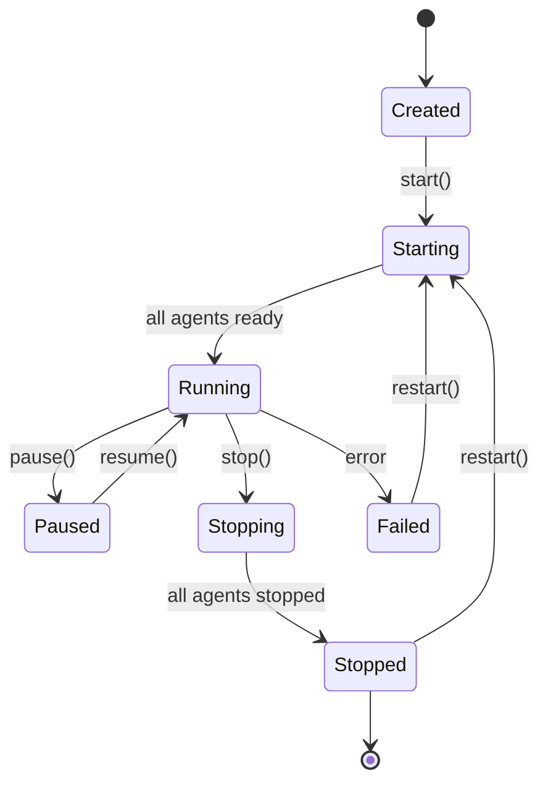

# Team Lifecycle Specification

## Phase 5: Team Management & Orchestration

### Overview

Teams are collections of agents that work together on projects. This specification defines how teams are created, configured, saved, loaded, started, and stopped as cohesive units. It introduces the concept of a "root agent" that serves as the team coordinator.

### Core Concepts

#### What is a Team?

A team is:
- A named collection of agent configurations
- A communication graph defining how agents interact
- Workflow phases defining execution order
- Shared context and project scope
- Persistent configuration that can be reused

#### Root Agent

The root agent is the team coordinator that:
- Receives initial user input
- Delegates tasks to other agents
- Monitors team progress
- Handles escalations
- Reports final results

**Characteristics:**
- Exactly one root agent per team
- Usually has the most general role (PM, Architect, Lead)
- Has visibility into all team communications
- Can override or redirect workflows

### Team Configuration Schema

#### JSON Format

```json
{
  "id": "team-uuid-12345",
  "name": "E-commerce Feature Team",
  "description": "Full-stack team for building e-commerce features",
  "projectId": "project-123",
  "version": "1.0.0",
  "createdAt": "2026-01-25T10:00:00Z",
  "updatedAt": "2026-01-25T14:30:00Z",
  "createdBy": "user-456",

  "metadata": {
    "tags": ["e-commerce", "full-stack", "agile"],
    "category": "development",
    "estimatedDuration": "2-4 hours",
    "complexity": "medium"
  },

  "agents": [
    {
      "id": "pm-alice",
      "configId": "config-pm-001",
      "name": "Alice",
      "role": "Product Manager",
      "isRoot": true,
      "workingDirectory": "./",
      "position": { "x": 100, "y": 100 },
      "bootstrapOverrides": {
        "mode": "auto",
        "additionalContext": "Focus on user stories and acceptance criteria"
      }
    },
    {
      "id": "fe-bob",
      "configId": "config-fe-001",
      "name": "Bob",
      "role": "Frontend Engineer",
      "isRoot": false,
      "workingDirectory": "./frontend",
      "position": { "x": 300, "y": 100 },
      "dependencies": ["pm-alice"]
    },
    {
      "id": "be-charlie",
      "configId": "config-be-001",
      "name": "Charlie",
      "role": "Backend Engineer",
      "isRoot": false,
      "workingDirectory": "./backend",
      "position": { "x": 300, "y": 300 },
      "dependencies": ["pm-alice"]
    }
  ],

  "connections": [
    {
      "id": "conn-1",
      "source": "pm-alice",
      "target": "fe-bob",
      "type": "delegation",
      "metadata": {
        "purpose": "requirements",
        "priority": "high"
      }
    },
    {
      "id": "conn-2",
      "source": "pm-alice",
      "target": "be-charlie",
      "type": "delegation",
      "metadata": {
        "purpose": "requirements",
        "priority": "high"
      }
    },
    {
      "id": "conn-3",
      "source": "fe-bob",
      "target": "be-charlie",
      "type": "collaboration",
      "metadata": {
        "purpose": "api-contract",
        "bidirectional": true
      }
    }
  ],

  "workflow": {
    "phases": [
      {
        "id": "phase-1",
        "name": "Planning",
        "agents": ["pm-alice"],
        "duration": "10m",
        "parallel": false
      },
      {
        "id": "phase-2",
        "name": "Implementation",
        "agents": ["fe-bob", "be-charlie"],
        "duration": "30m",
        "parallel": true
      },
      {
        "id": "phase-3",
        "name": "Review",
        "agents": ["pm-alice"],
        "duration": "10m",
        "parallel": false,
        "dependsOn": ["phase-2"]
      }
    ],

    "escalation": {
      "enabled": true,
      "conditions": [
        {
          "type": "timeout",
          "threshold": "60m",
          "action": "notify"
        },
        {
          "type": "error",
          "threshold": 3,
          "action": "pause"
        }
      ]
    }
  },

  "environment": {
    "variables": {
      "PROJECT_NAME": "E-commerce Platform",
      "API_VERSION": "v2",
      "TARGET_BRANCH": "feature/checkout"
    },
    "secrets": [
      "DATABASE_URL",
      "API_KEY"
    ]
  }
}
```

#### YAML Format (Alternative)

```yaml
name: E-commerce Feature Team
description: Full-stack team for building e-commerce features
version: 1.0.0

metadata:
  tags: [e-commerce, full-stack, agile]
  category: development
  complexity: medium

agents:
  - id: pm-alice
    name: Alice
    role: Product Manager
    isRoot: true
    workingDirectory: ./

  - id: fe-bob
    name: Bob
    role: Frontend Engineer
    workingDirectory: ./frontend

  - id: be-charlie
    name: Charlie
    role: Backend Engineer
    workingDirectory: ./backend

connections:
  - from: pm-alice
    to: [fe-bob, be-charlie]
    type: delegation
    purpose: requirements

  - from: fe-bob
    to: be-charlie
    type: collaboration
    purpose: api-contract

workflow:
  phases:
    - name: Planning
      agents: [pm-alice]
      duration: 10m

    - name: Implementation
      agents: [fe-bob, be-charlie]
      parallel: true
      duration: 30m

    - name: Review
      agents: [pm-alice]
      dependsOn: Implementation
```

### API Endpoints

#### Team CRUD Operations

```http
POST /api/teams
```
Create a new team configuration

**Request:**
```json
{
  "name": "Feature Team Alpha",
  "description": "Agile development team",
  "projectId": "project-123",
  "configuration": { /* team config */ }
}
```

**Response:**
```json
{
  "id": "team-789",
  "name": "Feature Team Alpha",
  "createdAt": "2026-01-25T10:00:00Z",
  "status": "created"
}
```

---

```http
GET /api/teams
```
List all teams (with filtering)

**Query Parameters:**
- `projectId` - Filter by project
- `category` - Filter by category
- `tags` - Comma-separated tags
- `search` - Search in name/description

---

```http
GET /api/teams/:teamId
```
Get team configuration

---

```http
PUT /api/teams/:teamId
```
Update team configuration

---

```http
DELETE /api/teams/:teamId
```
Delete team (if not running)

---

#### Team Lifecycle Operations

```http
POST /api/teams/:teamId/start
```
Start all agents in the team

**Request:**
```json
{
  "environment": {
    "PROJECT_NAME": "MyProject"
  },
  "initialPrompt": "Build user authentication",
  "options": {
    "parallel": true,
    "timeout": 3600000
  }
}
```

**Response:**
```json
{
  "sessionId": "session-123",
  "teamId": "team-789",
  "agents": [
    {
      "agentId": "pm-alice",
      "status": "starting",
      "pid": 12345
    },
    {
      "agentId": "fe-bob",
      "status": "starting",
      "pid": 12346
    }
  ],
  "startedAt": "2026-01-25T10:00:00Z"
}
```

---

```http
POST /api/teams/:teamId/stop
```
Stop all agents in the team

**Request:**
```json
{
  "force": false,
  "saveState": true
}
```

---

```http
GET /api/teams/:teamId/status
```
Get current team status

**Response:**
```json
{
  "teamId": "team-789",
  "sessionId": "session-123",
  "status": "running",
  "phase": "Implementation",
  "agents": [
    {
      "agentId": "pm-alice",
      "status": "idle",
      "lastActivity": "2026-01-25T10:05:00Z"
    },
    {
      "agentId": "fe-bob",
      "status": "working",
      "currentTask": "Building React components",
      "lastActivity": "2026-01-25T10:10:00Z"
    }
  ],
  "metrics": {
    "messagesExchanged": 42,
    "tasksCompleted": 5,
    "errorsEncountered": 0,
    "uptime": 600000
  }
}
```

---

```http
POST /api/teams/:teamId/restart
```
Restart team (stop then start)

---

```http
POST /api/teams/:teamId/pause
```
Pause team execution

---

```http
POST /api/teams/:teamId/resume
```
Resume paused team

---

#### Team Templates

```http
GET /api/teams/templates
```
List available team templates

```http
POST /api/teams/from-template
```
Create team from template

**Request:**
```json
{
  "templateId": "template-fullstack",
  "projectId": "project-123",
  "customizations": {
    "name": "My Custom Team",
    "agents": {
      "fe-bob": {
        "workingDirectory": "./src/frontend"
      }
    }
  }
}
```

### Workspace Assignment

#### Directory Structure

When a team starts, each agent gets its own working directory:

```
project-root/
├── .kokino/
│   ├── team.json           # Active team configuration
│   ├── session.json         # Current session data
│   └── agents/
│       ├── pm-alice/        # Root agent workspace
│       ├── fe-bob/          # Frontend agent workspace
│       └── be-charlie/      # Backend agent workspace
├── frontend/                # Actual frontend code
├── backend/                 # Actual backend code
└── shared/                  # Shared resources
```

#### Workspace Isolation Modes

1. **Shared Mode** (Default)
   - All agents work in the same directory tree
   - Can see and modify each other's files
   - Suitable for collaborative development

2. **Isolated Mode**
   - Each agent has a separate workspace copy
   - Changes are merged via git
   - Prevents conflicts

3. **Hybrid Mode**
   - Shared read, isolated write
   - Agents can read all files but write to separate branches
   - Automatic merging

### Root Agent Designation

#### Automatic Selection

If no root agent is specified, the system selects based on:
1. Agent with role matching: "PM", "Manager", "Lead", "Architect"
2. Agent with most connections (highest degree)
3. First agent in configuration

#### Root Agent Responsibilities

```javascript
class RootAgent {
  constructor(agentId, team) {
    this.agentId = agentId;
    this.team = team;
    this.subordinates = team.agents.filter(a => a.id !== agentId);
  }

  async coordinate() {
    // Receive initial user input
    const task = await this.receiveUserInput();

    // Break down into subtasks
    const subtasks = this.decomposeTask(task);

    // Delegate to team members
    for (const subtask of subtasks) {
      const agent = this.selectBestAgent(subtask);
      await this.delegate(agent, subtask);
    }

    // Monitor progress
    while (!this.isComplete()) {
      await this.monitorProgress();
      await this.handleEscalations();
    }

    // Collect results
    const results = await this.collectResults();

    // Report back to user
    return this.summarizeResults(results);
  }

  selectBestAgent(task) {
    // Logic to choose agent based on capabilities
    return this.subordinates.find(a =>
      a.capabilities.includes(task.type)
    );
  }
}
```

### Team Lifecycle States



### Implementation Classes

#### TeamManager

```javascript
class TeamManager {
  constructor(agentRegistry, configStore, workspaceManager) {
    this.registry = agentRegistry;
    this.configStore = configStore;
    this.workspace = workspaceManager;
    this.activeSessions = new Map();
  }

  async startTeam(teamId, options = {}) {
    const config = await this.configStore.getTeam(teamId);
    const session = {
      id: generateSessionId(),
      teamId,
      startedAt: new Date(),
      agents: new Map()
    };

    // Prepare workspaces
    for (const agentConfig of config.agents) {
      const workspace = await this.workspace.prepare(
        agentConfig.id,
        agentConfig.workingDirectory
      );
      agentConfig.workspace = workspace;
    }

    // Start root agent first
    const rootAgent = config.agents.find(a => a.isRoot);
    const rootProcess = await this.startAgent(rootAgent);
    session.agents.set(rootAgent.id, rootProcess);

    // Start other agents (parallel or sequential)
    const otherAgents = config.agents.filter(a => !a.isRoot);

    if (options.parallel) {
      const processes = await Promise.all(
        otherAgents.map(a => this.startAgent(a))
      );
      processes.forEach((p, i) => {
        session.agents.set(otherAgents[i].id, p);
      });
    } else {
      for (const agent of otherAgents) {
        const process = await this.startAgent(agent);
        session.agents.set(agent.id, process);
      }
    }

    this.activeSessions.set(session.id, session);
    return session;
  }

  async stopTeam(teamId, options = {}) {
    const session = this.findSessionByTeamId(teamId);
    if (!session) {
      throw new Error(`No active session for team ${teamId}`);
    }

    // Stop agents in reverse order (non-root first)
    const agents = Array.from(session.agents.entries());
    const rootAgent = agents.find(([id]) =>
      this.isRootAgent(id, session.teamId)
    );
    const otherAgents = agents.filter(([id]) =>
      !this.isRootAgent(id, session.teamId)
    );

    // Stop non-root agents
    for (const [id, process] of otherAgents) {
      await this.stopAgent(id, process, options);
    }

    // Stop root agent last
    if (rootAgent) {
      await this.stopAgent(rootAgent[0], rootAgent[1], options);
    }

    // Clean up workspaces if requested
    if (options.cleanWorkspace) {
      await this.workspace.cleanup(session.teamId);
    }

    this.activeSessions.delete(session.id);
    return { success: true, sessionId: session.id };
  }

  async getTeamStatus(teamId) {
    const session = this.findSessionByTeamId(teamId);
    if (!session) {
      return { status: 'stopped', teamId };
    }

    const agentStatuses = [];
    for (const [agentId, process] of session.agents) {
      const status = await this.registry.getAgentStatus(agentId);
      agentStatuses.push({
        agentId,
        ...status,
        pid: process.pid
      });
    }

    return {
      teamId,
      sessionId: session.id,
      status: this.deriveTeamStatus(agentStatuses),
      agents: agentStatuses,
      startedAt: session.startedAt,
      uptime: Date.now() - session.startedAt.getTime()
    };
  }
}
```

#### TeamConfigStore

```javascript
class TeamConfigStore {
  constructor(db) {
    this.db = db;
  }

  async saveTeam(config) {
    const id = config.id || generateId();
    const timestamp = new Date().toISOString();

    await this.db.run(`
      INSERT INTO teams (
        id, name, description, project_id,
        configuration, version, created_at, updated_at
      ) VALUES (?, ?, ?, ?, ?, ?, ?, ?)
    `, [
      id,
      config.name,
      config.description,
      config.projectId,
      JSON.stringify(config),
      config.version || '1.0.0',
      timestamp,
      timestamp
    ]);

    return { id, ...config };
  }

  async loadTeam(teamId) {
    const row = await this.db.get(`
      SELECT * FROM teams WHERE id = ?
    `, teamId);

    if (!row) {
      throw new Error(`Team ${teamId} not found`);
    }

    return JSON.parse(row.configuration);
  }

  async listTeams(filters = {}) {
    let query = 'SELECT * FROM teams WHERE 1=1';
    const params = [];

    if (filters.projectId) {
      query += ' AND project_id = ?';
      params.push(filters.projectId);
    }

    if (filters.category) {
      query += ' AND json_extract(configuration, "$.metadata.category") = ?';
      params.push(filters.category);
    }

    const rows = await this.db.all(query, params);
    return rows.map(row => ({
      id: row.id,
      name: row.name,
      description: row.description,
      projectId: row.project_id,
      version: row.version,
      createdAt: row.created_at,
      updatedAt: row.updated_at
    }));
  }
}
```

### Database Schema

```sql
-- Teams table
CREATE TABLE teams (
  id TEXT PRIMARY KEY,
  name TEXT NOT NULL,
  description TEXT,
  project_id TEXT REFERENCES projects(id),
  configuration JSON NOT NULL,
  version TEXT DEFAULT '1.0.0',
  created_by TEXT,
  created_at TEXT NOT NULL,
  updated_at TEXT NOT NULL
);

-- Team sessions table
CREATE TABLE team_sessions (
  id TEXT PRIMARY KEY,
  team_id TEXT REFERENCES teams(id),
  status TEXT NOT NULL,
  started_at TEXT NOT NULL,
  stopped_at TEXT,
  initial_prompt TEXT,
  environment JSON,
  metrics JSON
);

-- Team templates table
CREATE TABLE team_templates (
  id TEXT PRIMARY KEY,
  name TEXT NOT NULL,
  description TEXT,
  category TEXT,
  configuration JSON NOT NULL,
  is_public BOOLEAN DEFAULT true,
  created_by TEXT,
  created_at TEXT NOT NULL
);

-- Indexes
CREATE INDEX idx_teams_project ON teams(project_id);
CREATE INDEX idx_team_sessions_team ON team_sessions(team_id);
CREATE INDEX idx_team_sessions_status ON team_sessions(status);
```

### Testing Requirements

#### Unit Tests

```javascript
describe('TeamManager', () => {
  describe('startTeam', () => {
    it('should start root agent first', async () => {
      const team = await teamManager.startTeam('team-123');
      expect(startAgentSpy).toHaveBeenCalledWith(
        expect.objectContaining({ isRoot: true })
      );
    });

    it('should start other agents in parallel if specified', async () => {
      const team = await teamManager.startTeam('team-123', {
        parallel: true
      });
      expect(Promise.all).toHaveBeenCalled();
    });

    it('should prepare workspaces for each agent', async () => {
      await teamManager.startTeam('team-123');
      expect(workspaceManager.prepare).toHaveBeenCalledTimes(3);
    });
  });

  describe('stopTeam', () => {
    it('should stop agents in reverse order', async () => {
      await teamManager.stopTeam('team-123');
      expect(stopOrder).toEqual(['fe-bob', 'be-charlie', 'pm-alice']);
    });
  });
});
```

#### Integration Tests

1. Full team lifecycle (create, start, stop, delete)
2. Workspace isolation verification
3. Root agent coordination flow
4. Phase-based workflow execution
5. Error recovery and restart

#### Load Tests

- Start 10 teams simultaneously
- Verify resource usage per team
- Test maximum team size (20+ agents)
- Measure startup time vs team size

### Error Handling

#### Common Errors

1. **Agent Startup Failure**
   ```json
   {
     "error": "AGENT_START_FAILED",
     "agentId": "fe-bob",
     "reason": "Port 5173 already in use",
     "recovery": "Stop conflicting process or change port"
   }
   ```

2. **Workspace Conflict**
   ```json
   {
     "error": "WORKSPACE_CONFLICT",
     "path": "./frontend",
     "reason": "Directory already in use by another team",
     "recovery": "Use different workspace or stop other team"
   }
   ```

3. **Root Agent Missing**
   ```json
   {
     "error": "NO_ROOT_AGENT",
     "teamId": "team-123",
     "reason": "No agent designated as root",
     "recovery": "System will auto-select root agent"
   }
   ```

### Monitoring & Metrics

#### Team Metrics

```javascript
{
  teamId: "team-123",
  sessionId: "session-456",
  metrics: {
    // Performance
    startupTime: 4.5,          // seconds
    totalUptime: 3600,         // seconds

    // Activity
    messagesExchanged: 234,
    tasksCompleted: 12,
    filesCreated: 45,
    filesModified: 78,

    // Errors
    errorsEncountered: 2,
    recoveriesPerformed: 1,

    // Resource Usage
    cpuUsage: 45.2,           // percentage
    memoryUsage: 512,          // MB
    diskUsage: 128             // MB
  }
}
```

### Success Criteria

- [ ] Teams can be created, saved, and loaded
- [ ] All agents start/stop as a unit
- [ ] Root agent properly coordinates team
- [ ] Workspaces are correctly isolated
- [ ] Team status accurately reflects all agents
- [ ] Templates can be used to create teams
- [ ] Performance: Team startup < 10 seconds
- [ ] Can handle teams of 10+ agents
- [ ] Graceful error recovery
- [ ] Comprehensive API documentation
- [ ] 90% test coverage
- [ ] Monitoring dashboard available